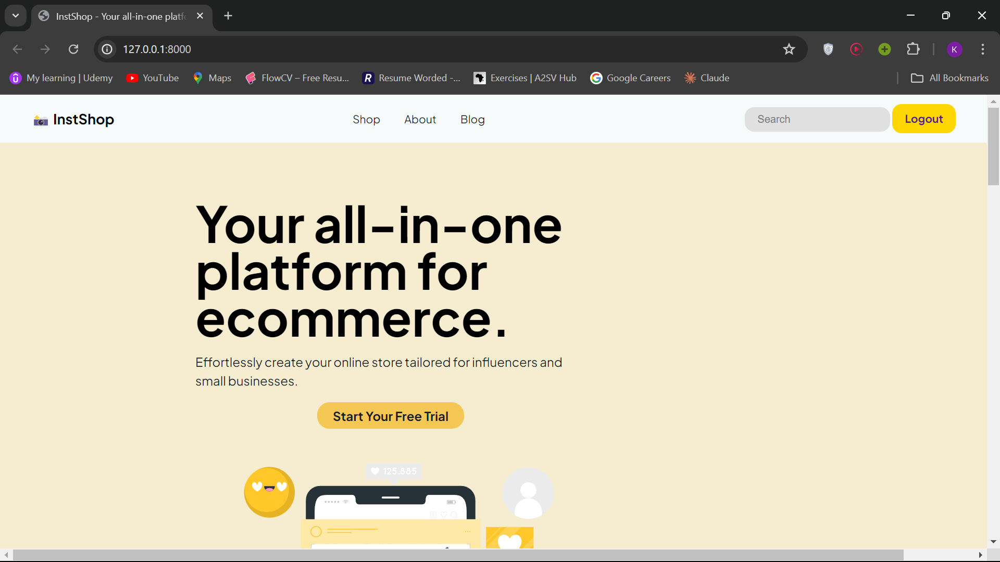
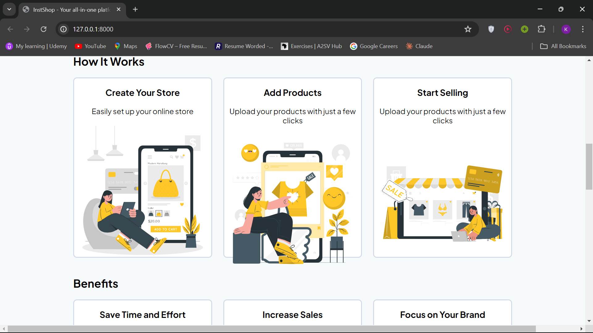
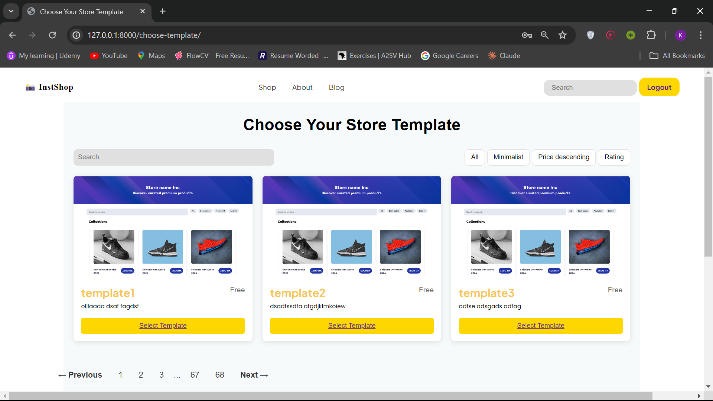
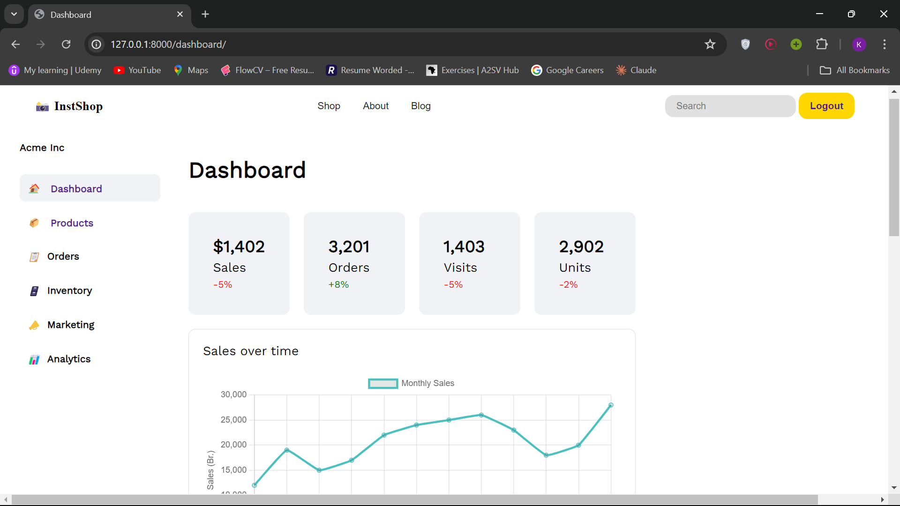

# InstaShop Dropshipping Platform

This project is a Django-based web application that simplifies web development and deployment for small and medium-sized businesses (SMBs), particularly for influencers and small-medium businesses in Africa. It aims to reduce costs and streamline the process of creating and managing online stores by integrating with third-party storage and delivery services.

## Table of Contents

- [Features](#features)
- [Images](#images)
- [Installation](#installation)
- [Usage](#usage)
- [Contributors](#contributors)

## Features

- User Registration and Authentication
- Template Choice
- Product Management
- Image uploads for Products
- General Reports
- User-specific product lists
- Search functionality
- Integration with third-party services

## Images

### The Landing Page

### The Template Choice

### The Dashboard

## Installation

    -git clone https://github.com/Kalkidan-Amare/instashop
    -cd udemy-clone
    -python -m venv venv
    -venv\Scripts\activate
    -pip install -r requirements.txt
    -python manage.py migrate
    -python manage.py createsuperuser
    -python manage.py runserver

## Usage

### User Registration and Authentication

- Users can register by visiting the signup page.
- After registering, users can log in to the application.
- Admin users can access the Django admin interface at `/admin/`.

### Course Management

- Admin users can create and manage products through the admin interface.
- Users can view a list of products, search for products, and add products to their personal list.

### Seller Features

- Sellers can choose from various templates for their website design.
- Sellers can add products to their website through a user-friendly interface.
- A dashboard is available for sellers to track overall traffic and transactions on their website.

### Buyer Features
- Buyers can visit the sellers' websites and purchase products directly.

## Contributors

- [Kalkidan Amare](https://github.com/Kalkidan-Amare) - Team Lead and Backend Developer
- [Nahom Tamirat](https://github.com/TNAHOM) - UI/UX and Frontend Developer
- [Naod Mulugeta](https://github.com/naodmulu) - Marketing Manager and Backend Developer
